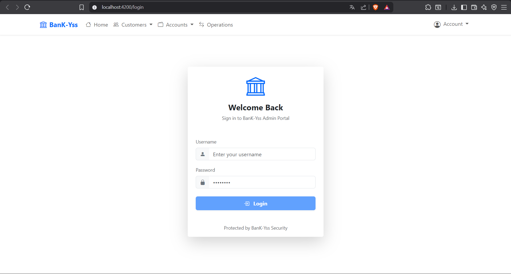
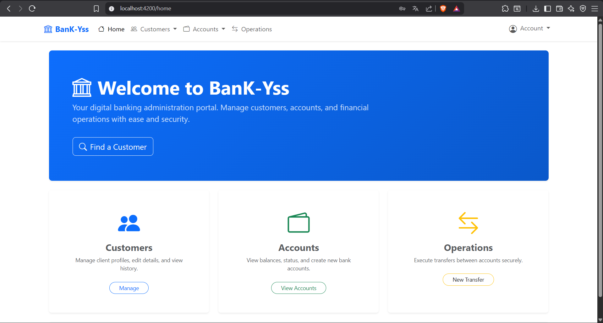
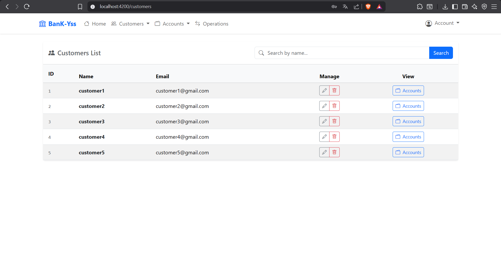
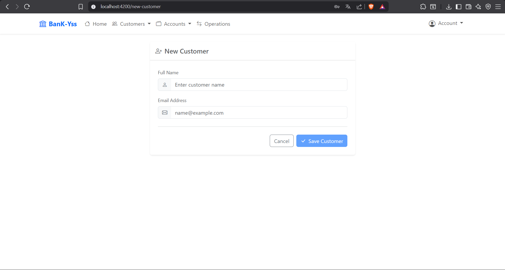
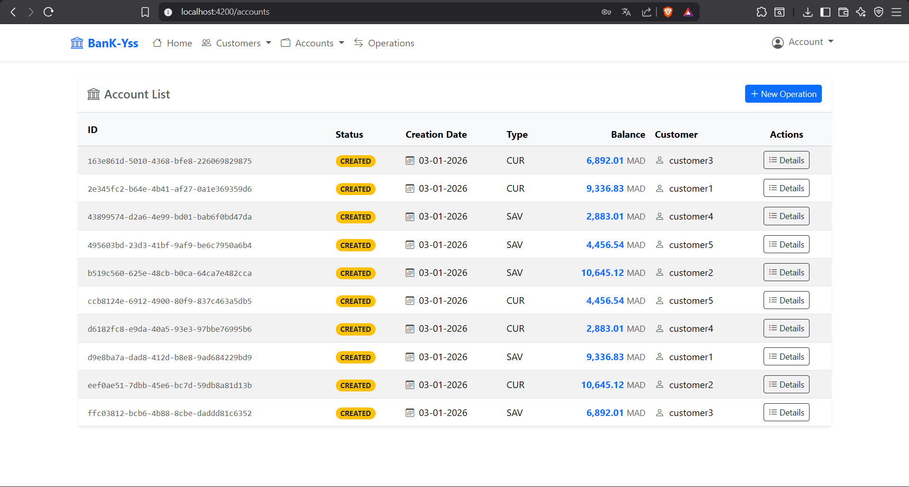
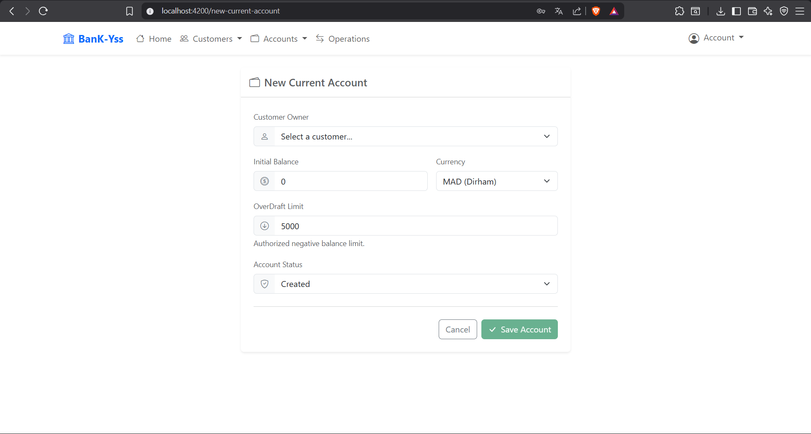
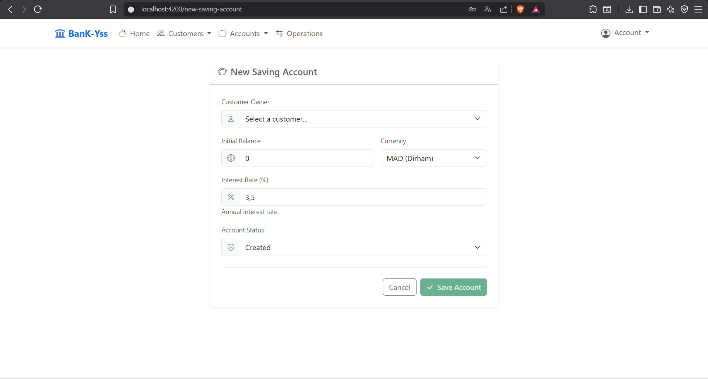
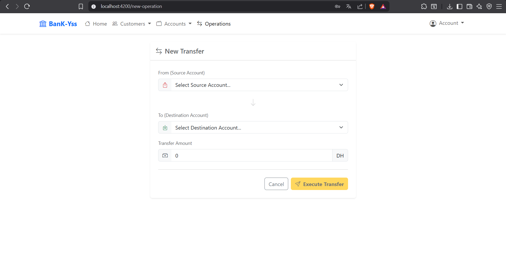

# 🏦 Digital Banking Platform

> A comprehensive full-stack digital banking solution. This system features a robust Spring Boot backend handling secure financial transactions and a modern, responsive Angular frontend for seamless user interaction.

## 📑 Table of Contents

* [System Architecture](https://www.google.com/search?q=%23%EF%B8%8F-system-architecture)
* [Core Features](https://www.google.com/search?q=%23-core-features)
* [Technology Stack](https://www.google.com/search?q=%23%EF%B8%8F-technology-stack)
* [Interface Showcase](https://www.google.com/search?q=%23-interface-showcase)
* [Quick Start Guide](https://www.google.com/search?q=%23-quick-start-guide)
* [Credits](https://www.google.com/search?q=%23-credits)

## 🏗️ System Architecture

The platform is built on a modern **Multi-Tier Architecture** ensuring high scalability and separation of concerns:

1. **Presentation Tier (SPA)**: An Angular application communicating asynchronously via HTTP/REST.
2. **Application Tier (API)**: A Spring Boot backend exposing secured RESTful web services.
3. **Data Tier**: A relational MySQL database for robust data persistence.

* 🔙 **[View Backend Documentation](https://www.google.com/search?q=./backend/README.md)**
* 🖥️ **[View Frontend Documentation](https://www.google.com/search?q=./frontend/README.md)**

## 🔐 Core Features

* **Security & Authentication**:
* Stateless authentication using **JSON Web Tokens (JWT)**.
* Role-Based Access Control (RBAC) supporting ADMIN and USER roles.


* **Customer Management**:
* Dynamic customer search functionality.
* Full CRUD operations (Create, Read, Update, Delete) for client profiles.


* **Bank Account Management**:
* Support for **Current Accounts** (including overdraft limits) and **Saving Accounts** (including interest rates).
* Real-time balance and account detail consultation.


* **Financial Operations**:
* **Debit**: Cash withdrawals.
* **Credit**: Cash deposits.
* **Transfer**: Secure account-to-account money transfers.


* **Transaction History**:
* Pagination and detailed consultation of all past operations linked to an account.


## 🛠️ Technology Stack

### Backend

* **Language**: Java 17
* **Framework**: Spring Boot 3
* **Data Persistence**: Spring Data JPA, Hibernate, MySQL
* **Security**: Spring Security, OAuth2 Resource Server, JWT

### Frontend

* **Framework**: Angular 17+
* **Language**: TypeScript
* **UI Library**: Bootstrap 5, Bootstrap Icons
* **State/Asynchronous Management**: RxJS

## 📸 Interface Showcase

| Authentication & Home | Customer Management |
| --- | --- |
| <br>

<br>

<br> | <br>

<br>

<br> |

| Account Overview & Creation | Financial Operations |
| --- | --- |
| <br>

<br>

<br><br>

<br> |  |

## 🚀 Quick Start Guide

### System Prerequisites (Fedora 43)

Ensure your local environment is fully equipped:

```bash
sudo dnf install java-17-openjdk-devel maven nodejs mysql-server
sudo systemctl start mysqld
sudo systemctl enable mysqld

```

### 1️⃣ Backend Setup & Launch

1. Log into MySQL and create the required database: `CREATE DATABASE digital_banking_db;`
2. Verify the database credentials in `backend/src/main/resources/application.properties`.
3. Compile and launch the Spring Boot server:
```bash
cd backend
mvn spring-boot:run

```


> 📍 API is now accessible at: `http://localhost:8085`


### 2️⃣ Frontend Setup & Launch

1. Install the necessary Node modules and start the Angular development server:
```bash
cd frontend
npm install
ng serve

```


> 📍 Web Application is now accessible at: `http://localhost:4200`


---

*Authored by Youssef Fellah.*
