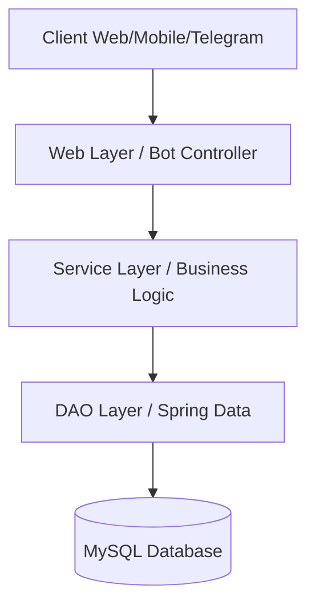

# 🏦 Digital Banking Backend

> A robust, secure, and intelligent backend banking application developed with **Spring Boot**. This core system integrates modern features such as JWT stateless security, a strict multi-tier architecture, and an AI-powered financial assistant accessible via a Telegram bot.

## 📑 Table of Contents

* [Key Features](https://www.google.com/search?q=%23-key-features)
* [System Architecture](https://www.google.com/search?q=%23%EF%B8%8F-system-architecture)
* [Detailed Layer Analysis](https://www.google.com/search?q=%23-detailed-layer-analysis)
* [Installation & Setup](https://www.google.com/search?q=%23-installation--setup)
* [API Documentation](https://www.google.com/search?q=%23-api-documentation)
* [Technology Stack](https://www.google.com/search?q=%23%EF%B8%8F-technology-stack)
* [Credits](https://www.google.com/search?q=%23-credits)

## ✨ Key Features

* **Customer Management:** Complete CRUD (Create, Read, Update, Delete) operations and dynamic search capabilities for client profiles.
* **Account Management:** Native support for both **Current Accounts** (incorporating overdraft limits) and **Saving Accounts** (incorporating variable interest rates).
* **Financial Operations:** Secure processing of debits, credits, and account-to-account transfers with strict transactional management.
* **Advanced Security:** Stateless authentication workflow utilizing **JSON Web Tokens (JWT)** alongside strict Role-Based Access Control (USER/ADMIN).
* **Intelligent Assistant:** An interactive Telegram bot featuring real-time balance inquiries, quick transfers via chat commands, and conversational financial support powered by OpenAI (ChatGPT).

## 🏗️ System Architecture

The project strictly adheres to an **N-Tier architecture** to guarantee high maintainability, separation of concerns, and scalability.



### Directory Structure

```text
src/main/java/com/youssef/backend
├── 📂 web          # REST Controllers (HTTP Entry Points)
├── 📂 bot          # Telegram Bot Service (Chat Entry Point)
├── 📂 services     # Business & Transactional Logic
├── 📂 entities     # Data Models (JPA)
├── 📂 repositories # Data Access Interfaces (Spring Data)
├── 📂 security     # JWT Configuration & Security Filters
├── 📂 dtos         # Data Transfer Objects (API/DB Isolation)
└── 📂 mappers      # Object Converters (MapStruct/BeanUtils)

```

## 📚 Detailed Layer Analysis

### 1️⃣ Data Layer (JPA & Entities)

Data persistence is managed using the **Single Table** inheritance strategy.

```java
@Entity
@Inheritance(strategy = InheritanceType.SINGLE_TABLE)
@DiscriminatorColumn(name = "TYPE", length = 4)
public abstract class BankAccount { ... }

```

**Technical Breakdown:** * **`@Inheritance(strategy = InheritanceType.SINGLE_TABLE)`**: Instead of creating separate tables for Current and Saving accounts, Hibernate merges all attributes into one single database table (`BankAccount`).

* **`@DiscriminatorColumn`**: This instructs JPA to use a specific column (named `TYPE`) to distinguish between the child classes. If a row has `TYPE = "CUR"`, Hibernate instantiates a Current Account object; if `"SAV"`, it instantiates a Saving Account. This optimizes database query performance by avoiding complex `JOIN` operations.

### 2️⃣ Security Layer (Spring Security & JWT)

The system employs **Stateless** security based on OAuth2 Resource Server standards.

```java
@Bean
public SecurityFilterChain securityFilterChain(HttpSecurity http) throws Exception {
    return http
            .sessionManagement(sm -> sm.sessionCreationPolicy(SessionCreationPolicy.STATELESS))
            .authorizeHttpRequests(ar -> ar.anyRequest().authenticated())
            .oauth2ResourceServer(oa -> oa.jwt(Customizer.withDefaults()))
            .build();
}

```

**Technical Breakdown:**

* **`.sessionCreationPolicy(STATELESS)`**: This disables traditional server-side HTTP sessions (Cookies/JSESSIONID). The server forgets the user the moment the request ends, vastly improving scalability.
* **`.oauth2ResourceServer(...)`**: This configures Spring to look for a Bearer token in the `Authorization` header of incoming HTTP requests. It intercepts the request, decodes the JWT, verifies its cryptographic signature, and extracts the user's roles before allowing access to the controllers.

### 3️⃣ Business Layer (Services & Transactions)

Data integrity is absolutely critical in banking and is guaranteed via the `@Transactional` annotation.

```java
@Transactional
public void transfer(String source, String dest, double amount) {
    debit(source, amount, "Transfer to " + dest);
    credit(dest, amount, "Transfer from " + source);
}

```

**Technical Breakdown:**

* **`@Transactional`**: This Spring annotation wraps the entire method inside a database transaction. It enforces the ACID property of Atomicity. If the `debit` succeeds but the `credit` fails (e.g., due to a network error or invalid destination), Spring automatically issues a `ROLLBACK` command to the database. The debit is undone, ensuring no money vanishes into thin air.

### 4️⃣ Web Layer (Controllers & DTOs)

The API strictly utilizes the **Data Transfer Object (DTO)** design pattern. JPA entities are never exposed directly to the web layer. This prevents infinite recursion errors during JSON serialization and protects sensitive database fields from unauthorized exposure.

### 5️⃣ Bot & AI Layer (Telegram & OpenAI)

This layer introduces next-generation user interaction. Users can execute commands like `/vir [Source] [Dest] [Amount]` for rapid money transfers. Furthermore, the bot leverages the GPT-3.5 model to parse natural language requests, providing contextual and intelligent responses based on the client's localized banking data.

## 🚀 Installation & Setup

### Prerequisites (Fedora 43)

Ensure your local environment is fully equipped:

```bash
sudo dnf install java-17-openjdk-devel maven mysql-server
sudo systemctl enable --now mysqld

```

### 1. Repository Cloning & Configuration

```bash
git clone https://github.com/yss-ef/[YOUR_REPO_NAME].git
cd [YOUR_REPO_NAME]

```

**⚠️ Important:** You must configure your environment variables. Copy the template file and fill in your credentials:

```bash
cp src/main/resources/application.properties.example src/main/resources/application.properties

```

Update the variables inside `application.properties`:

```properties
# Database Configuration
spring.datasource.url=jdbc:mysql://localhost:3306/BANK?createDatabaseIfNotExist=true
spring.datasource.username=root
spring.datasource.password=YOUR_SECURE_PASSWORD

# External APIs
telegram.bot.token=YOUR_TELEGRAM_BOT_TOKEN
telegram.bot.username=YOUR_BOT_USERNAME
openai.api.key=YOUR_OPENAI_API_KEY

```

### 2. Application Launch

Execute the following Maven command to compile and start the backend:

```bash
mvn spring-boot:run

```

The application will boot up and bind to `http://localhost:8085`. Test data is automatically injected into the MySQL database upon startup via the `CommandLineRunner` interface.

## 📡 API Documentation

### 🔐 Authentication

| Method | Endpoint | Description |
| --- | --- | --- |
| `POST` | `/auth/login` | Authenticate user (Body: `{"username": "...", "password": "..."}`) |
| `GET` | `/auth/profile` | Retrieve the currently authenticated user's profile |

### 👤 Customers (`/customers`)

| Method | Endpoint | Required Role | Description |
| --- | --- | --- | --- |
| `GET` | `/customers` | USER | Retrieve a complete list of customers |
| `GET` | `/customers/search?keyword=...` | USER | Search for specific customers by keyword |
| `POST` | `/customers` | ADMIN | Create and register a new customer profile |
| `DELETE` | `/customers/{id}` | ADMIN | Permanently delete a customer record |

### 🏦 Accounts & Operations (`/accounts`)

| Method | Endpoint | Required Role | Description |
| --- | --- | --- | --- |
| `GET` | `/accounts/{id}` | USER | Retrieve detailed metrics for a specific account |
| `GET` | `/accounts/{id}/operations` | USER | Retrieve the paginated transaction history |
| `POST` | `/accounts/debit` | ADMIN | Execute a cash withdrawal (debit) |
| `POST` | `/accounts/credit` | ADMIN | Execute a cash deposit (credit) |
| `POST` | `/accounts/transfer` | USER | Execute a secure account-to-account transfer |

## 🛠️ Technology Stack

| Category | Technology | Purpose |
| --- | --- | --- |
| **Language** | Java 17 | Core programming language |
| **Framework** | Spring Boot 3 | Application scaffolding and orchestration |
| **Data Access** | Spring Data JPA / Hibernate | ORM mapping and database interaction |
| **Database** | MySQL 8.0+ | Relational data persistence |
| **Security** | Spring Security / OAuth2 | Access control, stateless sessions, and JWT |
| **AI & Messaging** | OpenAI API / Telegram Bots API | Intelligent conversational assistant |
| **Tooling** | Maven, Lombok, MapStruct | Dependency management, boilerplate reduction, object mapping |

## 🧪 Testing

To execute the suite of unit and integration tests:

```bash
mvn test

```

---

*Authored by Youssef Fellah.*

*Developed as part of the 2nd year Engineering Cycle - Mundiapolis University.*
